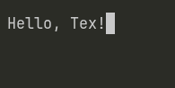

# Tex
A custom text editor built in C++

## What is it
Tex is a fully custom text editor built from scratch in C++. It is very simple and Unix only for now

## Usage
- Type the tex command with a filename to open the editor. It will create a file and open it to edit.
- ESC will exit the program and save the file

## Compiling
For now, it is only for unix. New updates will come soon.
1. Clone the repository with `git clone https://github.com/Renan-G-projec`
2. Build with cmake `cmake -B build && cmake --build build`
3. Run the project `./build/Tex ./built/test.txt`
